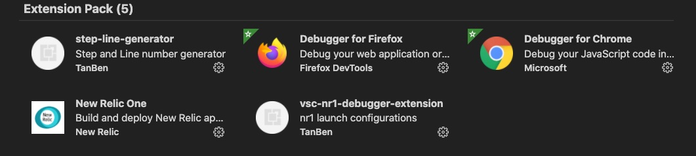
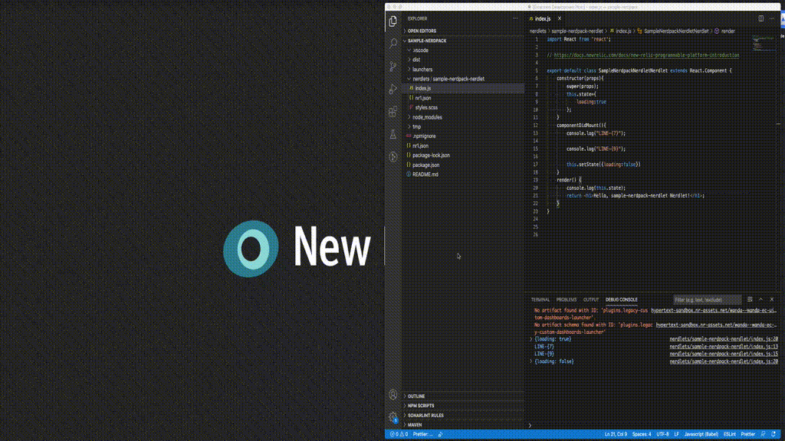

# README

New Relic One Debugger extension pack
This extension pack includes Chrome and Firefox debugger with launch configuration for debugging NR1 application(Nerdpack).

See [VSC-NR1-Debugger-Extension](https://github.com/tanben/vsc-nr1-debugger-extension).